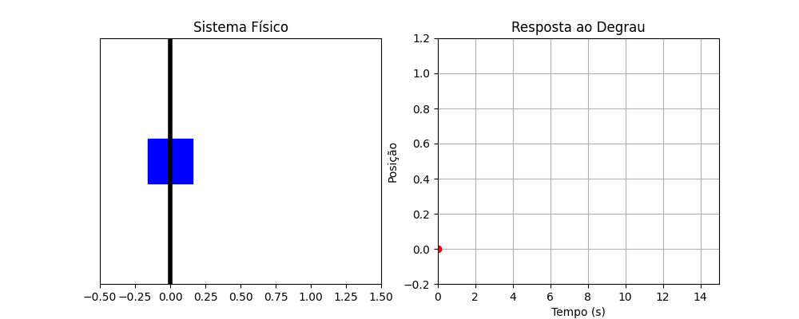
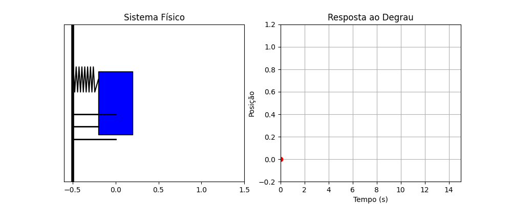
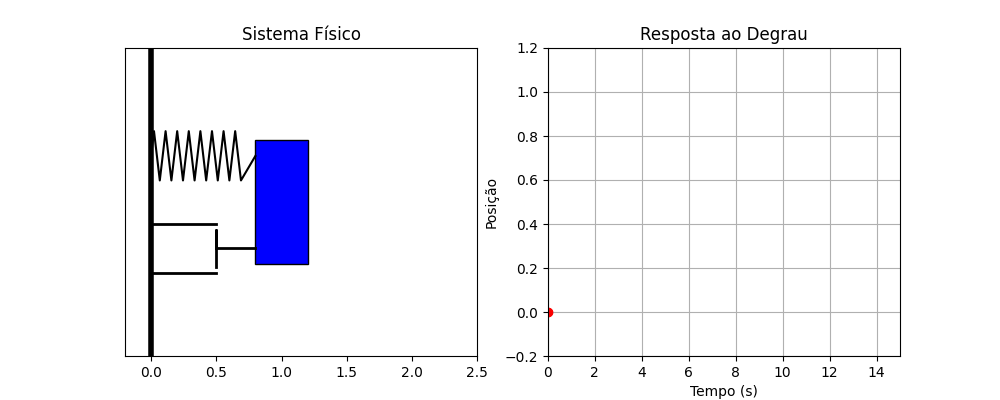

Coleção de animações produzidas com [Manim](https://www.manim.community/)
para uso didático em disciplinas de sistemas dinâmicos, controle e circuitos.
Cada card mostra a animação já renderizada e o script Python que a gera.

## Sistemas Dinâmicos

```{=html}
<div class="figura-grid">

<div class="figura-card">
  <div class="figura-preview"></div>
  <div class="figura-body">
    <h3>Massa-mola</h3>
    <p>Resposta de um sistema massa-mola (sem amortecimento) a uma entrada em degrau.</p>
    <div class="figura-tags"><span class="figura-tag">sistemas-dinamicos</span><span class="figura-tag">massa-mola</span></div>
    <div class="figura-downloads"><a class="figura-download" href="massa_mola.gif" download>GIF</a><a class="figura-download" href="SimulMMA.py" download>.py</a></div>
  </div>
</div>

<div class="figura-card">
  <div class="figura-preview"></div>
  <div class="figura-body">
    <h3>Massa-mola-amortecedor</h3>
    <p>Resposta de um sistema massa-mola-amortecedor a uma entrada em degrau.</p>
    <div class="figura-tags"><span class="figura-tag">sistemas-dinamicos</span><span class="figura-tag">massa-mola-amortecedor</span></div>
    <div class="figura-downloads"><a class="figura-download" href="massa_mola_amortecedor.gif" download>GIF</a><a class="figura-download" href="SimulMMA.py" download>.py</a></div>
  </div>
</div>

<div class="figura-card">
  <div class="figura-preview"></div>
  <div class="figura-body">
    <h3>Massa-mola-amortecedor (x₀ ≠ 0)</h3>
    <p>Resposta livre do sistema massa-mola-amortecedor a partir de uma condição inicial não nula.</p>
    <div class="figura-tags"><span class="figura-tag">sistemas-dinamicos</span><span class="figura-tag">condicao-inicial</span></div>
    <div class="figura-downloads"><a class="figura-download" href="massa_mola_amortecedor_x0.gif" download>GIF</a><a class="figura-download" href="SimulMMA.py" download>.py</a></div>
  </div>
</div>

</div>
```

## Eletrônica de Potência e Circuitos

```{=html}
<div class="figura-grid">

<div class="figura-card">
  <div class="figura-preview"><div class="figura-pendente">Animação ainda não renderizada</div></div>
  <div class="figura-body">
    <h3>Conversor Buck</h3>
    <p>Script de animação do conversor Buck (chaveamento, indutor, capacitor, carga).</p>
    <div class="figura-tags"><span class="figura-tag">eletronica-potencia</span><span class="figura-tag">buck</span></div>
    <div class="figura-downloads"><a class="figura-download" href="SimulBuck.py" download>.py</a></div>
  </div>
</div>

<div class="figura-card">
  <div class="figura-preview"><div class="figura-pendente">Animação ainda não renderizada</div></div>
  <div class="figura-body">
    <h3>Fasor e sinal senoidal</h3>
    <p>Relação entre o sinal senoidal no tempo e sua representação fasorial.</p>
    <div class="figura-tags"><span class="figura-tag">circuitos-ca</span><span class="figura-tag">fasor</span></div>
    <div class="figura-downloads"><a class="figura-download" href="SimulFasor.py" download>.py</a></div>
  </div>
</div>

</div>
```
